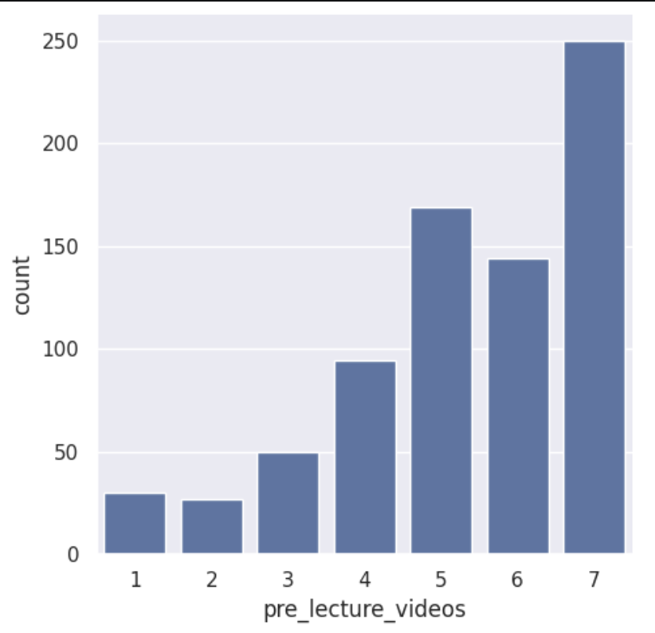
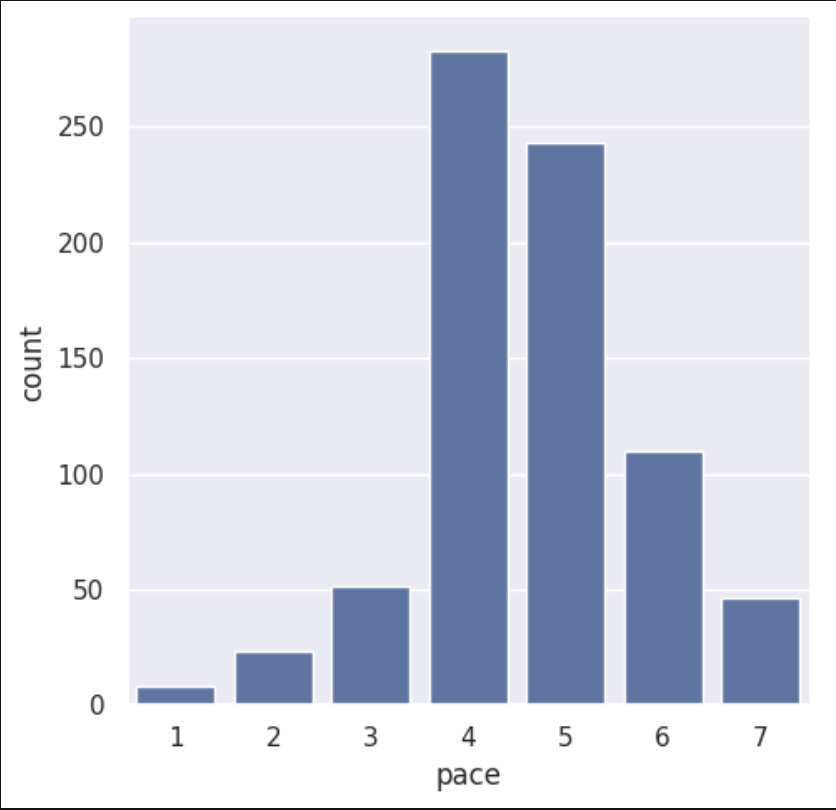
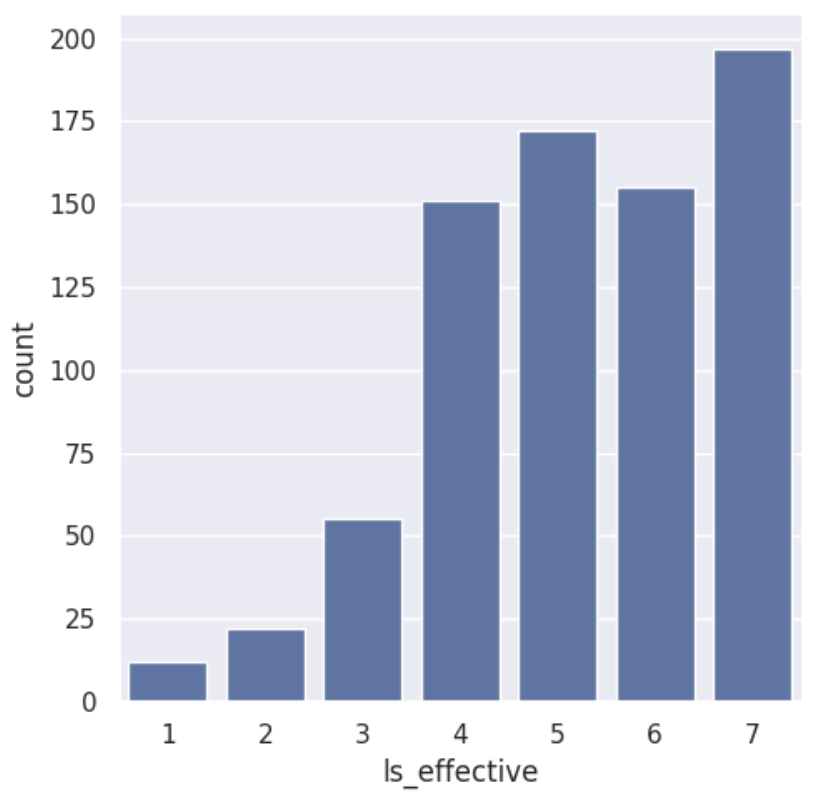
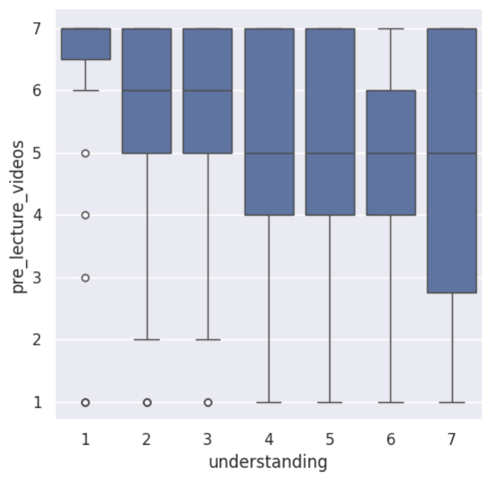
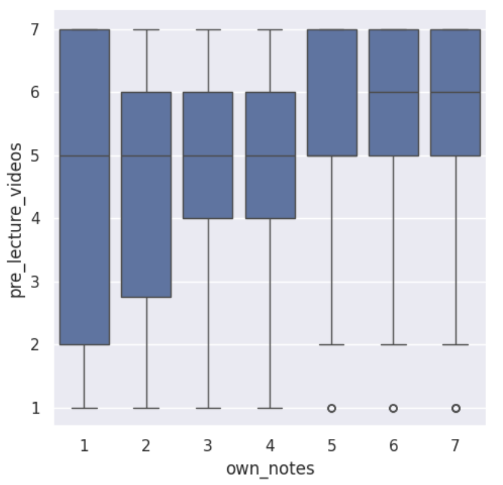

---
# Do not edit the text between these lines!
layout: default
---
# EX09: Data Analysis for Continuous Improvement

## Project Idea
I analyzed the idea that COMP110 should add pre-lecture videos. I chose this idea because pre-lecture videos could help students come to class with a general understanding of the lecture topic and make lecture time more productive for activities like memory diagrams, problem solving, and code writing.

## Why I Chose This Idea
This idea had one of the strongest connections to the available survey data because the dataset included both a direct question about pre-lecture videos and related questions about course pace, lesson video effectiveness, understanding, and note-taking habits.

## Summary of Analysis
My analysis generally supported the idea that COMP110 should add pre-lecture videos. Responses to the pre_lecture_videos question were concentrated toward the high end of the 1 to 7 scale, especially at 5, 6, and 7, which suggests that many students believe pre-lecture videos would be helpful.

The pace data also supported this idea. Many students reported that the course moves at a moderate to somewhat fast pace, suggesting that pre-lecture videos could help students by giving them an earlier introduction to lecture topics before class.

Responses to the lesson video effectiveness question were also generally high, which suggests that students already view video-based learning as effective in this course. In addition, support for pre-lecture videos remained relatively high across different levels of student understanding and across note-taking levels, which suggests that pre-lecture videos may have broad value for many different students in the course.

## Visualizations

### Support for Pre-Lecture Videos

### Course Pace

### Lesson Video Effectiveness

### Pre-Lecture Videos and Understanding

### Pre-Lecture Videos and Note-Taking

## Conclusion
Overall, the available survey data suggests that pre-lecture videos are a promising change that could improve the learning experience for many students in COMP110. The strongest evidence is that students directly supported the idea, and other survey patterns were consistent with the possibility that pre-lecture videos could help students come to class with first exposure to the material.

At the same time, this analysis does not prove that pre-lecture videos would directly cause better understanding or performance. A good next step would be to pilot short pre-lecture videos for a future unit and then collect new data on whether students felt more prepared, less rushed, and more able to engage during lecture.

There are also trade-offs to consider. Creating pre-lecture videos would require additional time from instructional staff, and some students might not watch them consistently. For that reason, a strong refinement would be to keep the videos short, optional, and closely connected to lecture goals.
